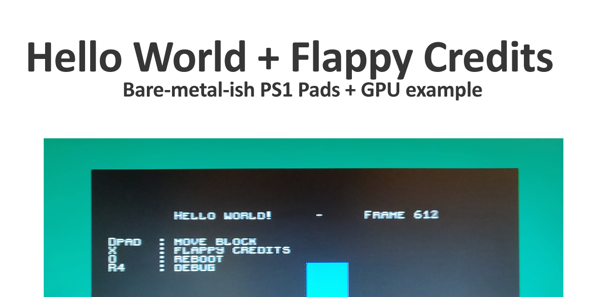

# Hello world! + Flappy Credits
	
	Example bare-metal code to get the pads + gpu going without using Sony's PS1 libraries.

	There's also a TTY device example to log printfs over Sio.

	First:
	Big thanks to Nicolas Noble over at https://github.com/grumpycoders/pcsx-redux/ 
	for the toolchain/build environment!
    
    
# Installation

	Brief:

		Install docker
		Whitelist this folder
		Run the .bat

	Instructions:

		Install this: https://www.docker.com/

		Goto Settings | Resources | File Sharing, and add this folder

		Run buildme.bat to build.

		Docker will do a one-time download of the build image (see intro) and to the thing.
		

# Questions

	Can I use some pre-made libraries?
		For PSYQ:
			they must be converted with this tool:	
		    https://github.com/grumpycoders/pcsx-redux/tree/main/tools/psyq-obj-parser
		For psn00b SDK:
		  	I'm not sure. Let me know how it goes!

